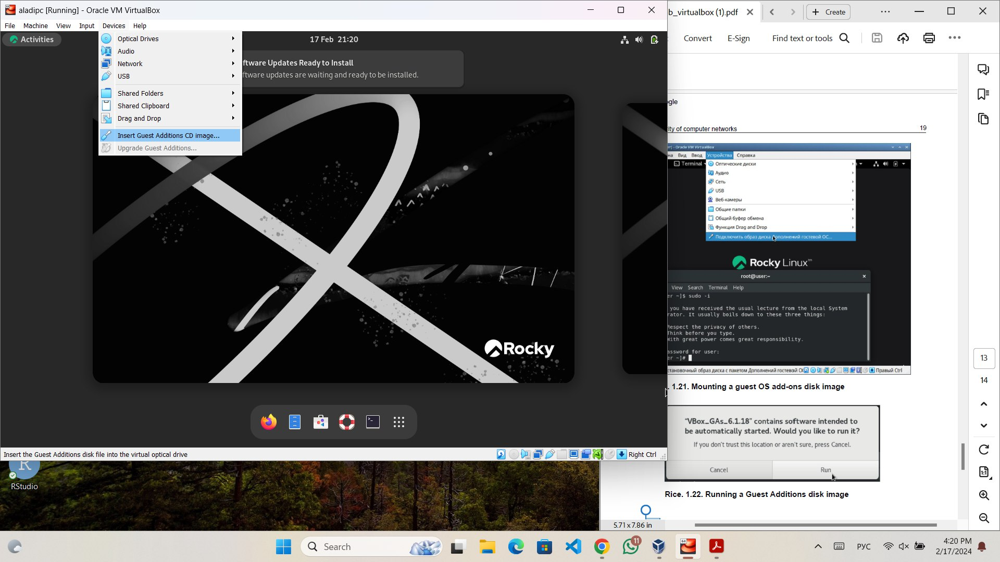
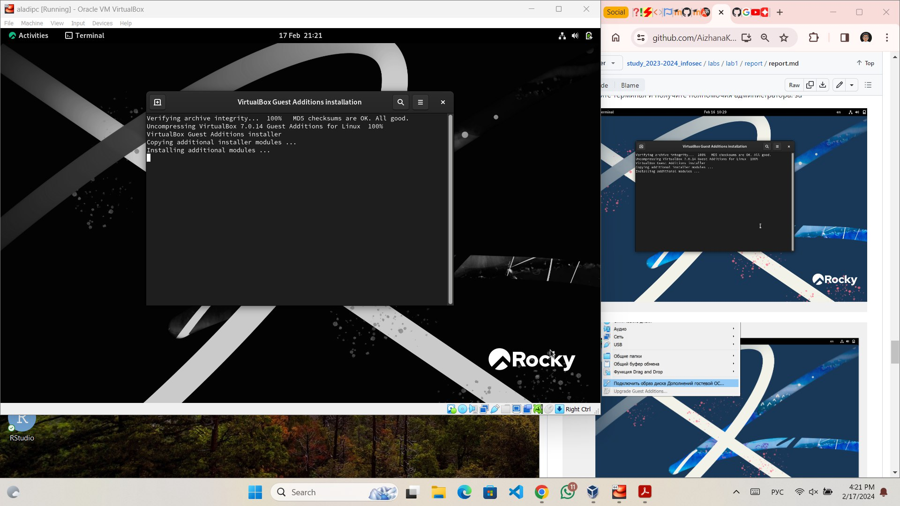
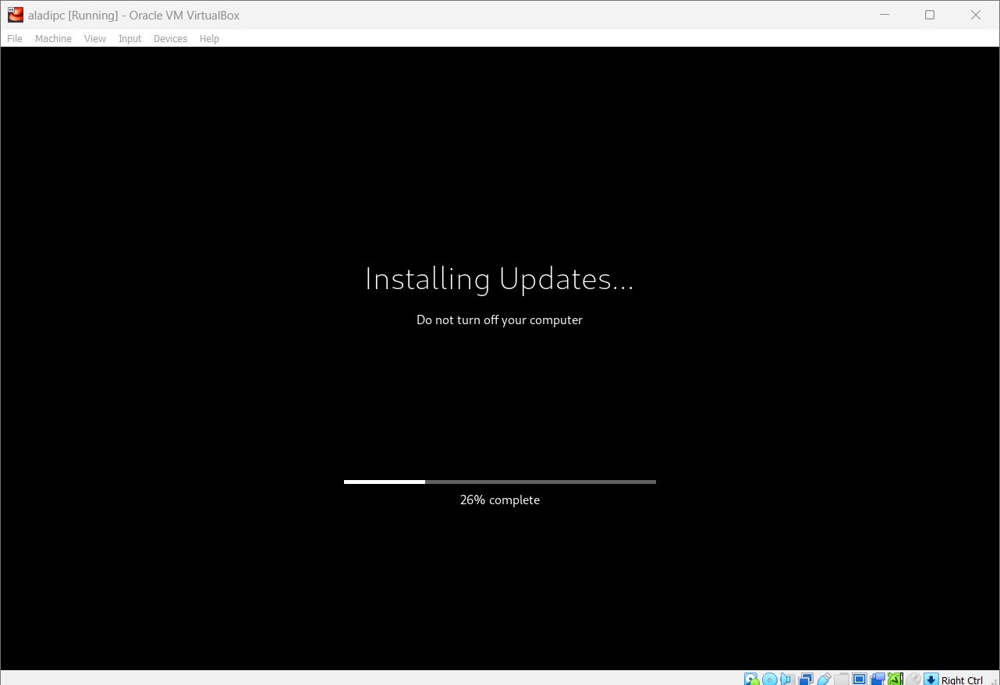
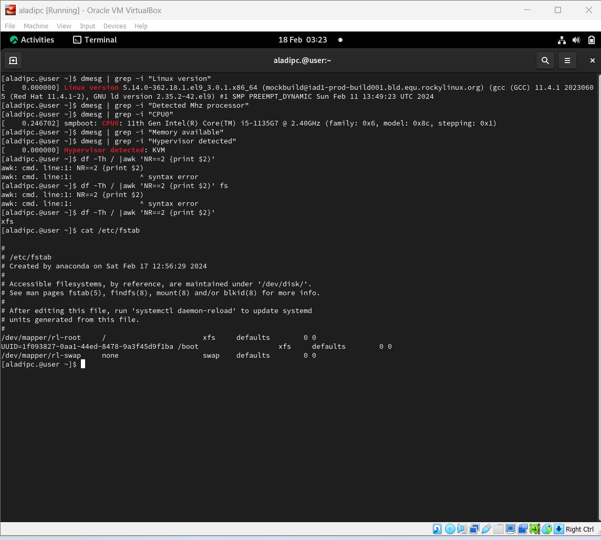

---
## Front matter
lang: ru-RU
title: "Лабораторная работа № 1"
subtitle: "Установка и конфигурация операционной системы на виртуальную машину"
author:
  - Алади П. Ч.
institute:
  - Российский университет дружбы народов, Москва, Россия
date: 17 февраля 2024

## i18n babel
babel-lang: russian
babel-otherlangs: english

## Formatting pdf
toc: false
toc-title: Содержание
slide_level: 2
aspectratio: 169
section-titles: true
theme: metropolis
header-includes:
 - \metroset{progressbar=frametitle,sectionpage=progressbar,numbering=fraction}
 - '\makeatletter'
 - '\beamer@ignorenonframefalse'
 - '\makeatother'
---

# Информация

## Докладчик

:::::::::::::: {.columns align=center}
::: {.column width="70%"}

  * Алади Принц Чисом
  * студент Факультета Физико-математических и естесственных наук 
  * Российский университет дружбы народов
  * [1032225007@pfur.ru](mailto:1032225007@pfur.ru)
  * <https://github.com/pjosh456/study_2023-2024_infosec>

## Объект и предмет исследования

- VirtualBox
- Rocky

## Цели 
 - приобретение практических навыков установки операционной системы на виртуальную машину
 - настройки минимально необходимых для дальнейшей работы сервисов.

# Результаты

- Нам удалось настроить виртуальную машину
 
# 

# 

# 

# 

:::

## {.Standout}
Спасибо за винимание

