---
## Front matter
title: "Лабораторная работа № 2"
subtitle: "Дискреционное разграничение прав в Linux. Основные атрибуты"
author: "Алади Принц Чисом"

## Generic otions
lang: ru-RU
toc-title: "Содержание"

## Bibliography
bibliography: bib/cite.bib
csl: pandoc/csl/gost-r-7-0-5-2008-numeric.csl

## Pdf output format
toc: true # Table of contents
toc-depth: 2
lof: true # List of figures
lot: true # List of tables
fontsize: 12pt
linestretch: 1.5
papersize: a4
documentclass: scrreprt
## I18n polyglossia
polyglossia-lang:
  name: russian
  options:
	- spelling=modern
	- babelshorthands=true
polyglossia-otherlangs:
  name: english
## I18n babel
babel-lang: russian
babel-otherlangs: english
## Fonts
mainfont: PT Serif
romanfont: PT Serif
sansfont: PT Sans
monofont: PT Mono
mainfontoptions: Ligatures=TeX
romanfontoptions: Ligatures=TeX
sansfontoptions: Ligatures=TeX,Scale=MatchLowercase
monofontoptions: Scale=MatchLowercase,Scale=0.9
## Biblatex
biblatex: true
biblio-style: "gost-numeric"
biblatexoptions:
  - parentracker=true
  - backend=biber
  - hyperref=auto
  - language=auto
  - autolang=other*
  - citestyle=gost-numeric
## Pandoc-crossref LaTeX customization
figureTitle: "Рис."
tableTitle: "Таблица"
listingTitle: "Листинг"
lofTitle: "Список иллюстраций"
lotTitle: "Список таблиц"
lolTitle: "Листинги"
## Misc options
indent: true
header-includes:
  - \usepackage{indentfirst}
  - \usepackage{float} # keep figures where there are in the text
  - \floatplacement{figure}{H} # keep figures where there are in the text
---

# Цель работы

Получение практических навыков работы в консоли с атрибутами файлов, закрепление теоретических основ дискреционного разграничения доступа в современных системах с открытым кодом на базе ОС Linux1.

# Выполнение лабораторной работы

1. Создать пользователя guest. При помощи команды 

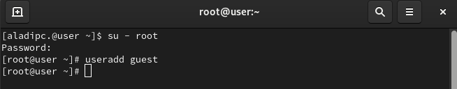{#fig:001}

2. Задать новому пользователю пароль, при помощи утилиты passwd.

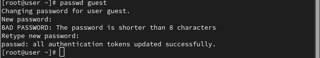{#fig:002}

3. Войти в новую сессию под пользователем guest.

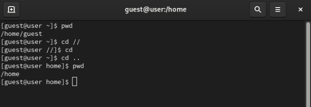{#fig:003}

4. Открыть терминал и посмотреть в какой мы директории. Для этого будет использовать pwd (print workdir). Вывод команды можно увидеть на картинке @fig:001. Данная директория является домашней для пользователя guest.

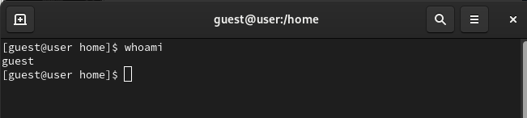{#fig:004}

5. Для того, чтобы узнать username пользоваться, воспользуемся командой whoami 
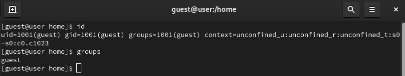{#fig:005}=

6. Посмотрим на вывод команды id. Там мы видим UID, GID и дополнительные метки пользователя. Вывод информации о группах сопоставим (@fig:002) с тем, что мы увидем, при запуске команды groups.

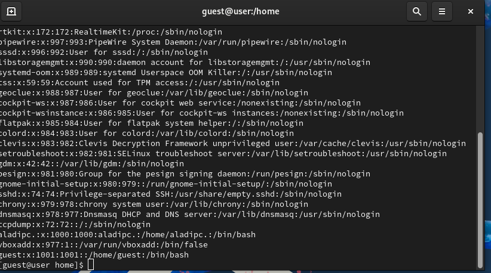{#fig:006}

7. Пользователь guest и в приглашение командной строки имеет в себе username guest.

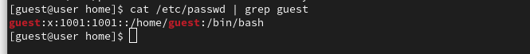{#fig:007}

8. В файле `/etc/passwd` лежит информация о всех пользователях системы (@fig:003). UID = 1001, GUID=1002.

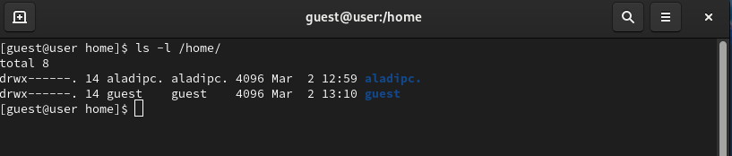{#fig:008}

9. В директории `/home/` у нас находятся все папки для каждого пользователя системы (@fig:004) (кроме системных пользователей). На обоих папках права выставлены 700.

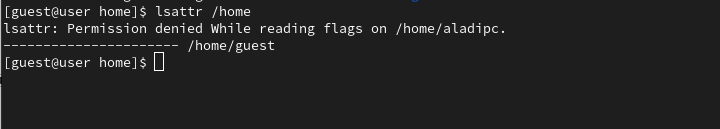{#fig:009}

10. Расширенные атрибуты удастся посмотреть только для директорий, до которых может достучаться пользователь. Потому там и появилась ошибка доступа (@fig:005).

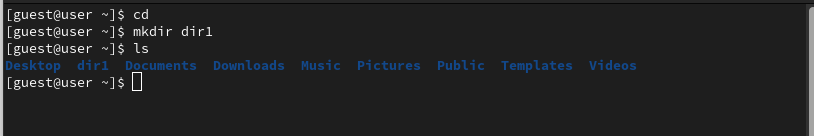{#fig:010}

11. Создадим директорию `dir1` в домашнем каталоге. Посмотрим на ее права и атрибуты (@fig:006). На dir1 выставлены права 755.

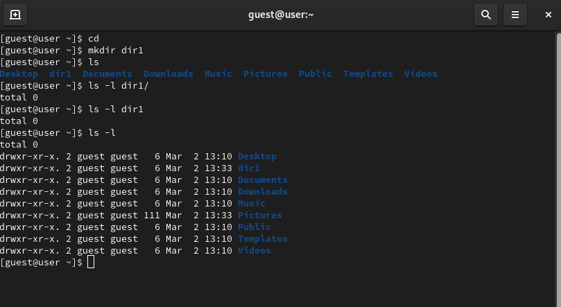{#fig:011}

12. Обнулим (@fig:011) права доступа, при помощи chmod.

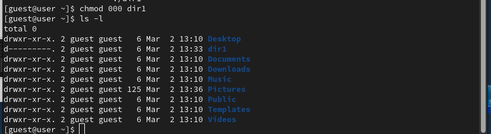{#fig:012}

13. При попытке создать файл --- получаем ошибку доступа из-за отсутствия прав для кого-либо.

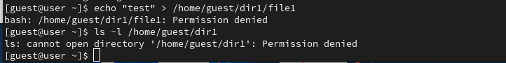{#fig:0013}

14. Заполним таблицу "Установленные права и разрешённые действия". 

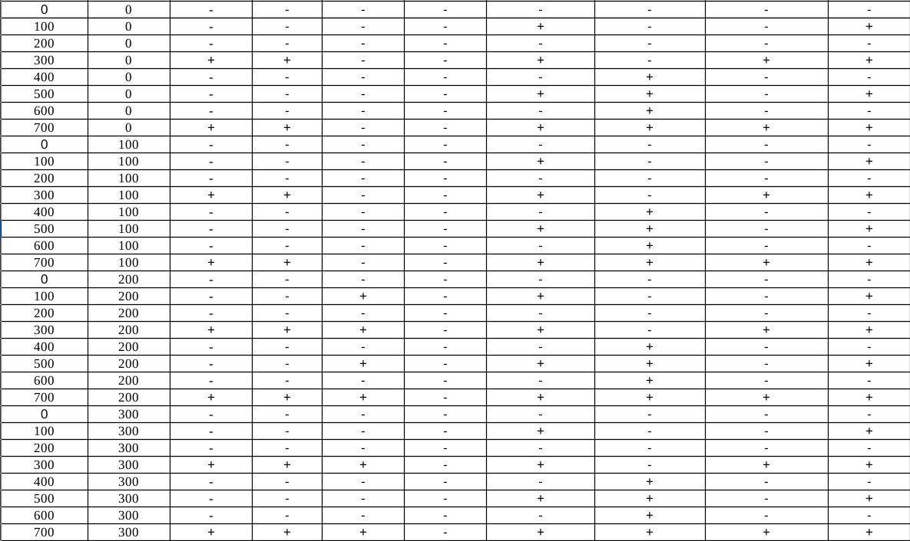{#fig:014}

15. На основе таблицы (@fig:009;@fig:010) составим таблицу с "Минимальные права для совершения операций" (@fig:014).

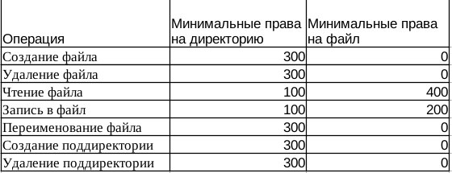{#fig:015}

# Выводы

По итогам выполнения работы, я приобрел навыки работы в консоли с атрибутами файлов.
:::
