---
## Front matter
lang: ru-RU
title: Лабораторная работа № 3
subtitle: Дискреционное разграничение прав в Linux. Два пользователя
author:
   - Алади П. Ч.
institute:
  - Российский университет дружбы народов, Москва, Россия
date: 15 марта 2024

## i18n babel
babel-lang: russian
babel-otherlangs: english

## Formatting pdf
toc: false
toc-title: Содержание
slide_level: 2
aspectratio: 169
section-titles: true
theme: metropolis
header-includes:
 - \metroset{progressbar=frametitle,sectionpage=progressbar,numbering=fraction}
 - '\makeatletter'
 - '\beamer@ignorenonframefalse'
 - '\makeatother'
---

# Информация

## Докладчик

:::::::::::::: {.columns align=center}
::: {.column width="70%"}

  * Алади Принц Чисом
  * студент Факультета Физико-математических и естесственных наук 
  * Российский университет дружбы народов
  * [1032225007@pfur.ru](mailto:1032225007@pfur.ru)
  * <https://github.com/pjosh456/study_2023-2024_infosec>

## Цель работы

Получение практических навыков работы в консоли с атрибутами фай-
лов для групп пользователей1.

## Выполнение лабораторной работы

 1. Создать пользователя guest, guest2. Добавить guest2 в группу guest. 

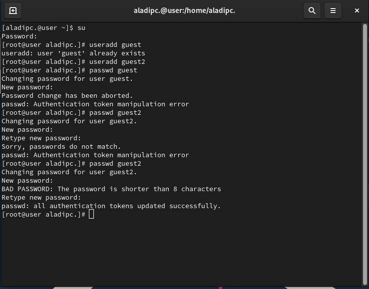{#fig:001}

2. Зайти в сессии данных пользователей и посмотреть вывод команды `pwd`.

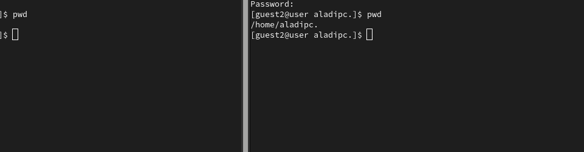{#fig:002}

##
3. Проверим идентификаторы групп. Значения из `id` совпадают с `groups`.

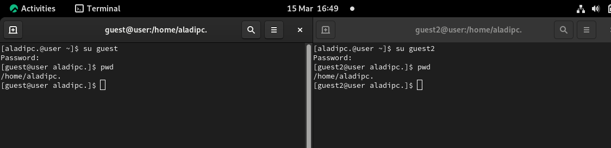{#fig:003}

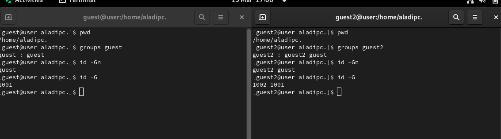{#fig:004}

4. В файле `/etc/group` можем наблюдать GID наших групп.

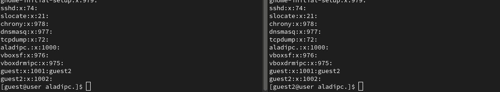{#fig:005}

##

5. Обнулим права на `/home/guest/dir1` и выдадим группе `guest` права 7 на "хомяка" пользователя.

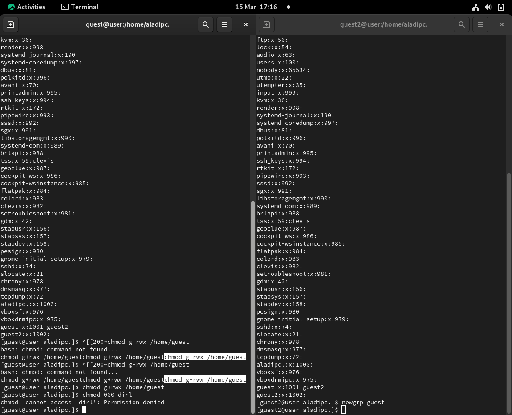{#fig:006}

## Таблица с правами

## Установленные права и разрешённые действия для групп

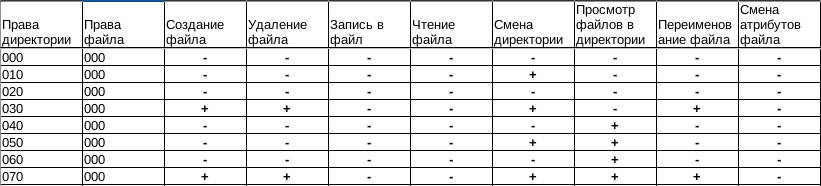{#fig:007} 

{#fig:008} 

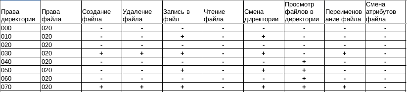{#fig:009} 

##

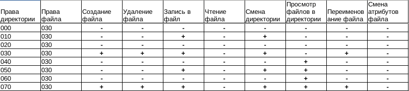{#fig:010} 

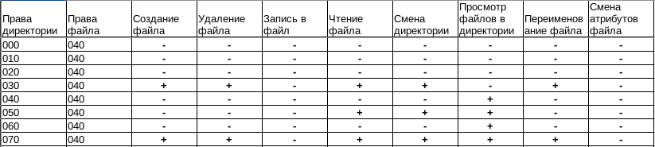{#fig:011} 

{#fig:012} 

##
{#fig:013} 

{#fig:014} 

## Минимальные права для совершения операций от имени пользователей входящих в группу

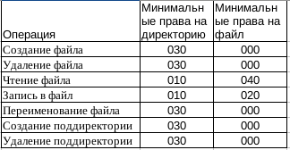{#fig:015} 

## Выводы

По итогам выполнения работы, я приобрел навыки работы в консоли с атрибутами файлов для групп пользователей..

## Список литературы{.unnumbered}

::: {#refs}
:::

