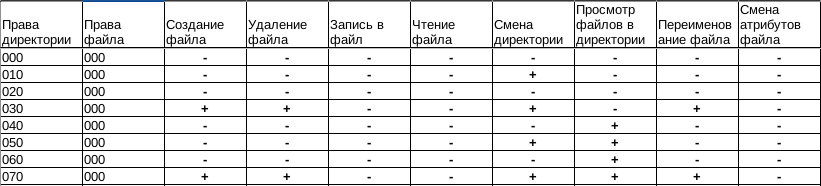

---
## Front matter
title: "Шаблон отчёта по Лабораторная работа No 3"
subtitle: "Простейший вариант"
author: "Алади Принц Чисом"

## Generic otions
lang: ru-RU
toc-title: "Содержание"

## Bibliography
bibliography: bib/cite.bib
csl: pandoc/csl/gost-r-7-0-5-2008-numeric.csl

## Pdf output format
toc: true # Table of contents
toc-depth: 2
lof: true # List of figures
lot: true # List of tables
fontsize: 12pt
linestretch: 1.5
papersize: a4
documentclass: scrreprt
## I18n polyglossia
polyglossia-lang:
  name: russian
  options:
	- spelling=modern
	- babelshorthands=true
polyglossia-otherlangs:
  name: english
## I18n babel
babel-lang: russian
babel-otherlangs: english
## Fonts
mainfont: PT Serif
romanfont: PT Serif
sansfont: PT Sans
monofont: PT Mono
mainfontoptions: Ligatures=TeX
romanfontoptions: Ligatures=TeX
sansfontoptions: Ligatures=TeX,Scale=MatchLowercase
monofontoptions: Scale=MatchLowercase,Scale=0.9
## Biblatex
biblatex: true
biblio-style: "gost-numeric"
biblatexoptions:
  - parentracker=true
  - backend=biber
  - hyperref=auto
  - language=auto
  - autolang=other*
  - citestyle=gost-numeric
## Pandoc-crossref LaTeX customization
figureTitle: "Рис."
tableTitle: "Таблица"
listingTitle: "Листинг"
lofTitle: "Список иллюстраций"
lotTitle: "Список таблиц"
lolTitle: "Листинги"
## Misc options
indent: true
header-includes:
  - \usepackage{indentfirst}
  - \usepackage{float} # keep figures where there are in the text
  - \floatplacement{figure}{H} # keep figures where there are in the text
---

# Цель работы

Получение практических навыков работы в консоли с атрибутами фай-
лов для групп пользователей1.

# Выполнение лабораторной работы

 1. Создать пользователя guest, guest2. Добавить guest2 в группу guest. 

{#fig:001}

2. Зайти в сессии данных пользователей и посмотреть вывод команды `pwd`.

{#fig:002}

3. Проверим идентификаторы групп. Значения из `id` совпадают с `groups`.

{#fig:003}

{#fig:004}

4. В файле `/etc/group` можем наблюдать GID наших групп.

{#fig:005}

5. Обнулим права на `/home/guest/dir1` и выдадим группе `guest` права 7 на "хомяка" пользователя.

{#fig:006}

## Таблица с правами

### Установленные права и разрешённые действия для групп

{#fig:007} 

{#fig:008} 

{#fig:009} 

{#fig:010} 

{#fig:011} 

{#fig:012} 

{#fig:013} 

{#fig:014} 

### Минимальные права для совершения операций от имени пользователей входящих в группу

{#fig:015} 

# Выводы

По итогам выполнения работы, я приобрел навыки работы в консоли с атрибутами файлов для групп пользователей..

# Список литературы{.unnumbered}

::: {#refs}
:::
