---
## Front matter
lang: ru-RU
title: Лабораторная работа № 4
subtitle: Дискреционное разграничение прав в Linux. Расширенные атрибуты
author:
  - Алади П. Ч.
institute:
  - Российский университет дружбы народов, Москва, Россия
date: 29 марта 2024

## i18n babel
babel-lang: russian
babel-otherlangs: english

## Formatting pdf
toc: false
toc-title: Содержание
slide_level: 2
aspectratio: 169
section-titles: true
theme: metropolis
header-includes:
 - \metroset{progressbar=frametitle,sectionpage=progressbar,numbering=fraction}
 - '\makeatletter'
 - '\beamer@ignorenonframefalse'
 - '\makeatother'
---

# Информация

## Докладчик

:::::::::::::: {.columns align=center}
::: {.column width="70%"}

  * Алади Принц Чисом
  * студент Факультета Физико-математических и естесственных наук 
  * Российский университет дружбы народов
  * [1032225007@pfur.ru](mailto:1032225007@pfur.ru)
  * <https://github.com/pjosh456/study_2023-2024_infosec>

## Цель работы

Получение практических навыков работы в консоли с расширенными атрибутами файлов

## Выполнение лабораторной работы

1) От имени пользователя "guest" я определил расширенные атрибуты файла "file1". Атрибутов нет (рис. [-@fig:001]).

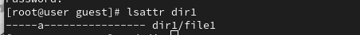{#fig:001 width=70%}

2) С помощью команды дал права файлу на чтение и написание (рис. [-@fig:002]).

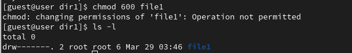{#fig:002 width=70%}

##
3) От имени пользователи "guest" я попробовал установить на файл атрибут "а", но мне выдало ошибку (рис. [-@fig:003]).

{#fig:003 width=70%}

4) Я зашел в другую консоль и выдал права администратора. Затем выдал файлу атрибут "а". Файл получил атрибут успешно (рис. [-@fig:004]).

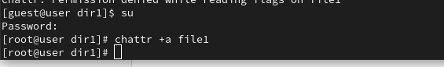{#fig:004 width=70%}

##
5) Я проверил наличие атрибута у файла, используя пользователя "guest" (рис. [-@fig:005]).

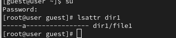{#fig:005 width=70%}

6) Я попытался вписать в файл текст, но у меня выдало ошибку. После проверки текста в самом файле, команда ничего не выдала, так как файл пустой (рис. [-@fig:006]).

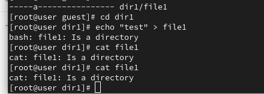{#fig:006 width=70%}

7) Я попробовал переименовать файл, но у меня не получилось. Так же попробовал удалить файл, опять показало ошибку. И удалить содержимое файла я так же не смог (рис. [-@fig:007]).

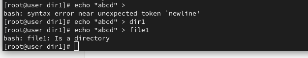{#fig:007 width=70%}

##
8) Я попытался изменить права у файла, но опять появилась ошибка (рис. [-@fig:008]).

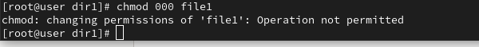{#fig:008 width=70%}

9) Я забрал атрибут "а" у файла и проделал все манипуляции снова. Я смог вписать текст в файл, прочитать файл, удалить текст, переименовать файл, сменить атрибуты у файла и удалить файл (рис. [-@fig:009]).

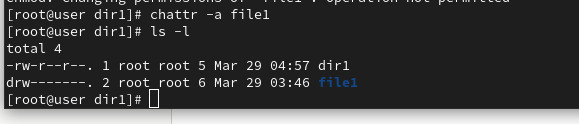{#fig:009 width=70%}

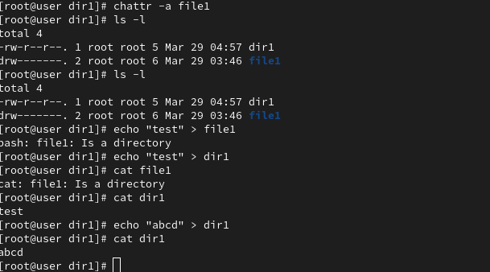{#fig:010 width=70%}
10) Я добавил вместо атрибута "а", атрибут "i". У меня не получилось вписать текст в файл, переименовать файл, удалить файл и добавить права (рис. [-@fig:0011]).

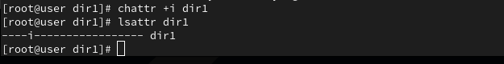{#fig:011 width=70%}

##
11) Я забрал атрибут "i" и проверил всю работоспособность файла. Файл может выполнять все доступные функции (рис. [-@fig:012]).

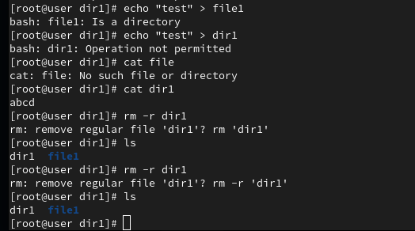{#fig:012 width=70%}

12) Я составил таблицу сравнения атрибутов "а" и "i". Если убрать все атрибуты, то никаких различий не будет (рис. [-@fig:013]).

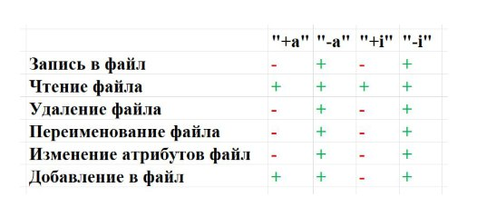{#fig:013 width=70%}

## Выводы

Я получил практические навыки работы в консоли с расширенными атрибутами файлов.
:::

