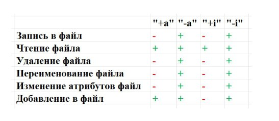

---
## Front matter
title: "Лабораторная работа № 4"
subtitle: "Дискреционное разграничение прав в Linux. Расширенные атрибуты"
author: "Адади Принц Чисом"

## Generic otions
lang: ru-RU
toc-title: "Содержание"

## Bibliography
bibliography: bib/cite.bib
csl: pandoc/csl/gost-r-7-0-5-2008-numeric.csl

## Pdf output format
toc: true # Table of contents
toc-depth: 2
lof: true # List of figures
lot: true # List of tables
fontsize: 12pt
linestretch: 1.5
papersize: a4
documentclass: scrreprt
## I18n polyglossia
polyglossia-lang:
  name: russian
  options:
	- spelling=modern
	- babelshorthands=true
polyglossia-otherlangs:
  name: english
## I18n babel
babel-lang: russian
babel-otherlangs: english
## Fonts
mainfont: PT Serif
romanfont: PT Serif
sansfont: PT Sans
monofont: PT Mono
mainfontoptions: Ligatures=TeX
romanfontoptions: Ligatures=TeX
sansfontoptions: Ligatures=TeX,Scale=MatchLowercase
monofontoptions: Scale=MatchLowercase,Scale=0.9
## Biblatex
biblatex: true
biblio-style: "gost-numeric"
biblatexoptions:
  - parentracker=true
  - backend=biber
  - hyperref=auto
  - language=auto
  - autolang=other*
  - citestyle=gost-numeric
## Pandoc-crossref LaTeX customization
figureTitle: "Рис."
tableTitle: "Таблица"
listingTitle: "Листинг"
lofTitle: "Список иллюстраций"
lotTitle: "Список таблиц"
lolTitle: "Листинги"
## Misc options
indent: true
header-includes:
  - \usepackage{indentfirst}
  - \usepackage{float} # keep figures where there are in the text
  - \floatplacement{figure}{H} # keep figures where there are in the text
---

# Цель работы

Получение практических навыков работы в консоли с расширенными атрибутами файлов

# Выполнение лабораторной работы

1) От имени пользователя "guest" я определил расширенные атрибуты файла "file1". Атрибутов нет (рис. [-@fig:001]).

{#fig:001 width=70%}

2) С помощью команды дал права файлу на чтение и написание (рис. [-@fig:002]).

{#fig:002 width=70%}

3) От имени пользователи "guest" я попробовал установить на файл атрибут "а", но мне выдало ошибку (рис. [-@fig:003]).

{#fig:003 width=70%}

4) Я зашел в другую консоль и выдал права администратора. Затем выдал файлу атрибут "а". Файл получил атрибут успешно (рис. [-@fig:004]).

{#fig:004 width=70%}

5) Я проверил наличие атрибута у файла, используя пользователя "guest" (рис. [-@fig:005]).

{#fig:005 width=70%}

6) Я попытался вписать в файл текст, но у меня выдало ошибку. После проверки текста в самом файле, команда ничего не выдала, так как файл пустой (рис. [-@fig:006]).

{#fig:006 width=70%}

7) Я попробовал переименовать файл, но у меня не получилось. Так же попробовал удалить файл, опять показало ошибку. И удалить содержимое файла я так же не смог (рис. [-@fig:007]).

{#fig:007 width=70%}

8) Я попытался изменить права у файла, но опять появилась ошибка (рис. [-@fig:008]).

{#fig:008 width=70%}

9) Я забрал атрибут "а" у файла и проделал все манипуляции снова. Я смог вписать текст в файл, прочитать файл, удалить текст, переименовать файл, сменить атрибуты у файла и удалить файл (рис. [-@fig:009]).

{#fig:009 width=70%}

{#fig:010 width=70%}
10) Я добавил вместо атрибута "а", атрибут "i". У меня не получилось вписать текст в файл, переименовать файл, удалить файл и добавить права (рис. [-@fig:0011]).

{#fig:011 width=70%}

11) Я забрал атрибут "i" и проверил всю работоспособность файла. Файл может выполнять все доступные функции (рис. [-@fig:012]).

{#fig:012 width=70%}

12) Я составил таблицу сравнения атрибутов "а" и "i". Если убрать все атрибуты, то никаких различий не будет (рис. [-@fig:013]).

{#fig:013 width=70%}

# Выводы

Я получил практические навыки работы в консоли с расширенными атрибутами файлов.
