---
## Front matter
lang: ru-RU
title: Лабораторная работа № 5
subtitle: Дискреционное разграничение прав в Linux. Исследование влияния дополнительных атрибуто
author:
   - Алади П. Ч.
institute:
  - Российский университет дружбы народов, Москва, Россия
date: 12 Арг. 2024

## i18n babel
babel-lang: russian
babel-otherlangs: english

## Formatting pdf
toc: false
toc-title: Содержание
slide_level: 2
aspectratio: 169
section-titles: true
theme: metropolis
header-includes:
 - \metroset{progressbar=frametitle,sectionpage=progressbar,numbering=fraction}
 - '\makeatletter'
 - '\beamer@ignorenonframefalse'
 - '\makeatother'
---

# Информация

## Докладчик

:::::::::::::: {.columns align=center}
::: {.column width="70%"}

  * Алади Принц Чисом
  * студент Факультета Физико-математических и естесственных наук 
  * Российский университет дружбы народов
  * [1032225007@pfur.ru](mailto:1032225007@pfur.ru)
  * <https://github.com/pjosh456/study_2023-2024_infosec>

# Цель работы
Изучение механизмов изменения идентификаторов, применения SetUID- и Sticky-битов. Получение практических навыков работы в консоли с дополнительными атрибутами. Рассмотрение работы механизма смены идентификатора процессов пользователей, а также влияние бита Sticky на запись и удаление файлов.

## Выполнение лабораторной работы
1) Я создал файл "simpleid.c" и внёс в него программу.

{#fig:001 width=70%}
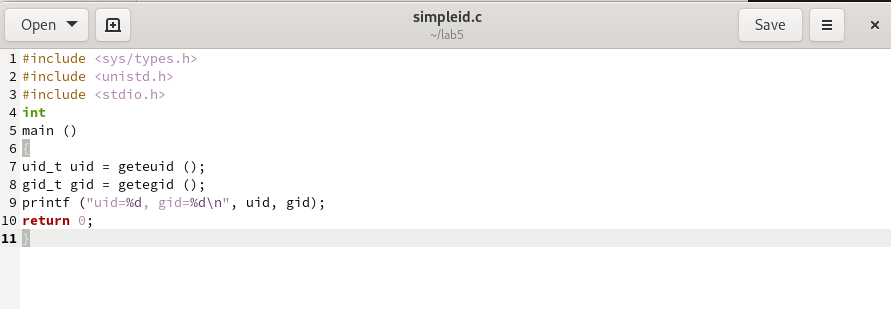{#fig:002 width=70%}

##
2) Скомпилировал программу и убедился, что файл создан правильно.

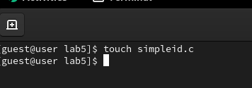{#fig:002 width=70%}

3) Запустил программу и посмотрел, как она работает. Затем прописал команду "id", чтобы сравнить данные. Все данные сходятся. 

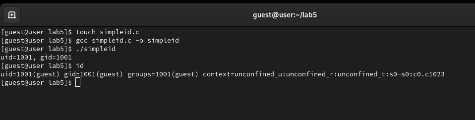{#fig:003 width=70%}

##
4) Создал второй файл и назвал его "simlpeid2.c". Усложнил первую программу и внёс ее в файл.

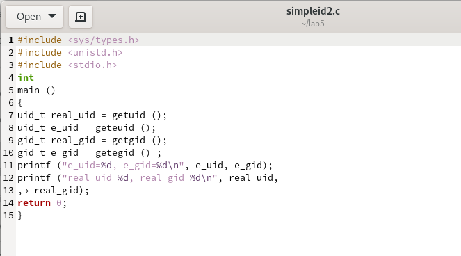{#fig:004 width=70%}

5) Скомпилировал и посмотрел вторую программу. Проверил как она работает.

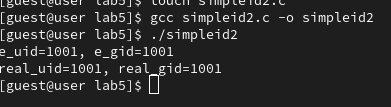{#fig:005 width=70%}

##
6) От имени суперпользователя я выполнил команды и временно повысил свои права. Команды сменили пользователя файла на root и установили SetUID-бит. Я запустил файл от имени root-пользователя и проверил сходство с командой "id".

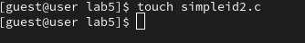{#fig:007 width=70%}

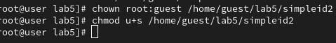{#fig:008 width=70%}

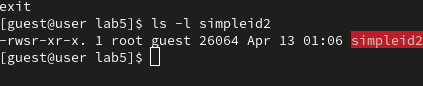{#fig:009 width=70%}

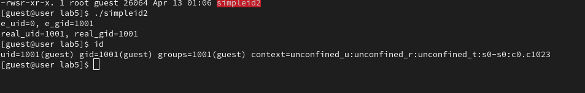{#fig:010 width=70%}

##
7) Я создал файл "readfile.c". Внёс туда программу.

{#fig:011 width=70%}

##
8) Скомпилировал программу readfile.

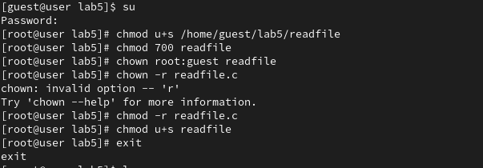{#fig:012 width=70%}

9) Я выдал программе "readfile" права так, чтобы root пользователь мог прочитать файл, а простой пользователь нет. 

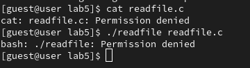{#fig:013 width=70%}

10) Я сменил владельца программы "readfile" на root-пользователя. 

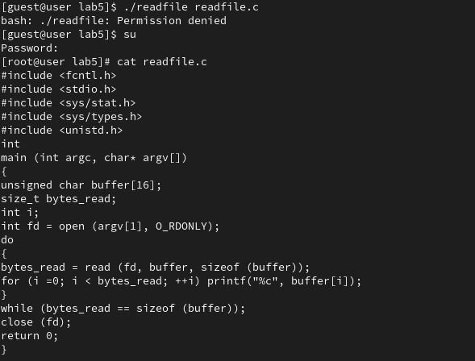{#fig:014 width=70%}

##
11) Попытался запустить программу и прочитать два файла с простого пользователя, но программа выдала ошибку. А если запускать с аккаунта root, то программа запускается нормально и работает. Связано это с тем, что владельцем программы является root-пользователь, а у других пользователей нет доступа и прав на использование программы. 

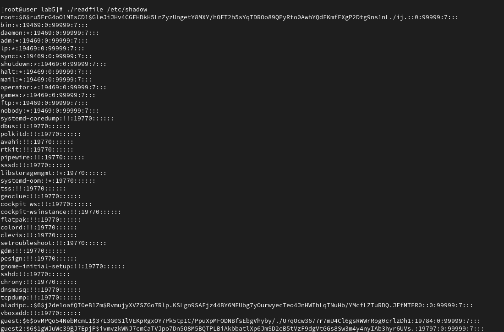{#fig:015 width=70%}

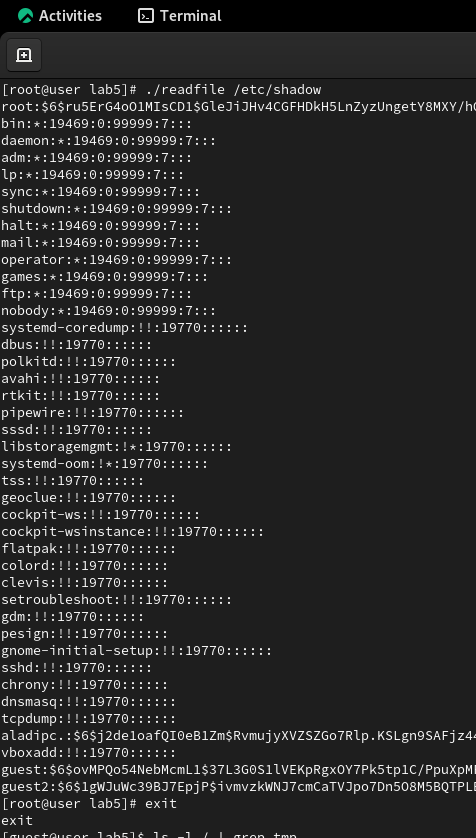{#fig:016 width=70%}

## Исследование Sticky-бита.

1) Я выяснил, установлен ли атрибут Sticky (t) на директории "/tmp". Атрибут установлен.

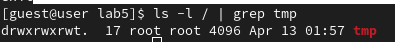{#fig:017 width=70%}

##
2) От пользователя "guest" я создал файл "file01.txt" в  директории "/tmp". Вписал в файл слово "test". И дал права на чтение и запись для категории "все остальные (о)".

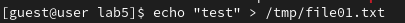{#fig:018 width=70%}

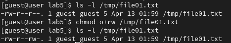{#fig:019 width=70%}

##
3) От пользователя "guest2", который не явлется владельцем, я попробовал прочитать файл. Я могу прочитать файл. Но не могу дописывать содержимое, вписывать новое или удалять этот файл. 

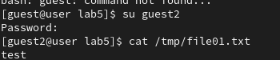{#fig:020 width=70%}

##
4) я отключил атрибут "t" у директории "/tmp". Попробовал повторить все предыдущие действия. Я так же не смог вписать в файл данные или дописать их. Но смог прочитать файл и удалить его. 

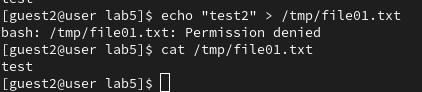{#fig:021 width=70%}

##
5) Чтобы в дальнейшем у меня не было проблем в работе с директорией "/tmp" я вернул атрибут на директорию, используя суперпользователя. 

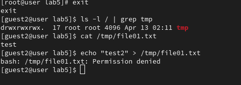{#fig:023 width=70%}

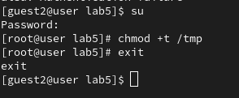{#fig:024 width=70%}

## Выводы

Я изучил механизмы изменения идентификатора, применил SetUID-бит и Stickу-бит. Получил практические навыки работы в консоли с дополнительными атрибутами. Рассмотрел работы механизма смены идентификатора процессов пользователя, а так же влияние бита Sticky на запись и удаление файлов. 

## Список литературы{.unnumbered}

::: {#refs}
:::

