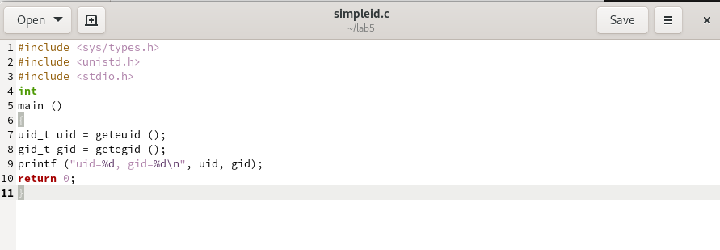
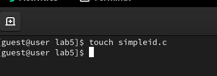
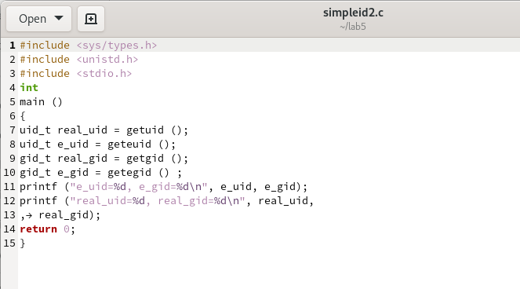
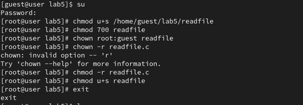
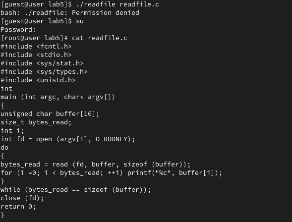
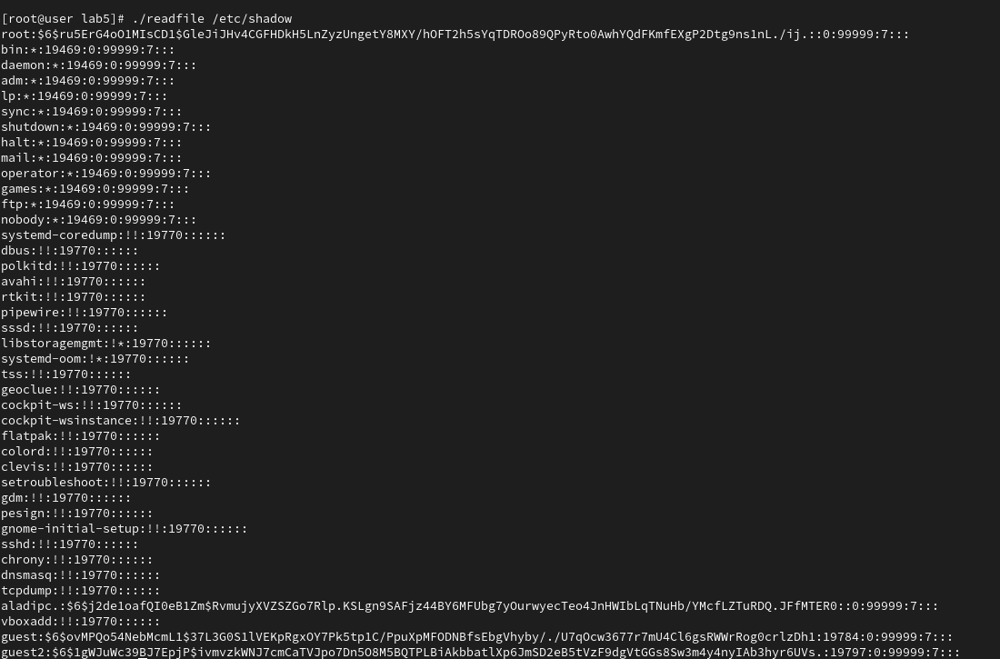
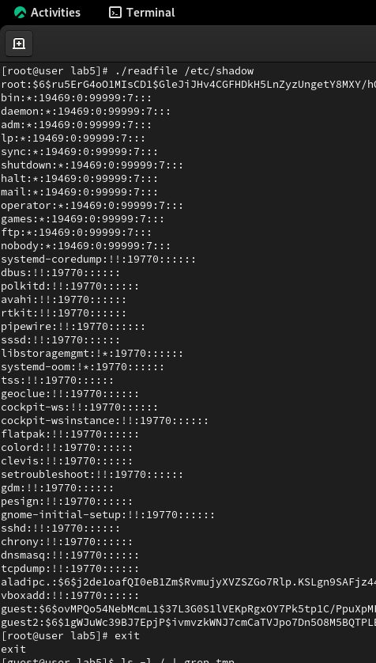
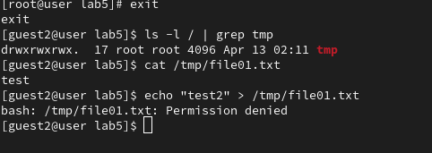

---
## Front matter
title: "Лабораторная работа № 5"
subtitle: "Дискреционное разграничение прав в Linux. Исследование влияния дополнительных атрибуто"
author: "Алади Принц Чисом"

## Generic otions
lang: ru-RU
toc-title: "Содержание"

## Bibliography
bibliography: bib/cite.bib
csl: pandoc/csl/gost-r-7-0-5-2008-numeric.csl

## Pdf output format
toc: true # Table of contents
toc-depth: 2
lof: true # List of figures
lot: true # List of tables
fontsize: 12pt
linestretch: 1.5
papersize: a4
documentclass: scrreprt
## I18n polyglossia
polyglossia-lang:
  name: russian
  options:
	- spelling=modern
	- babelshorthands=true
polyglossia-otherlangs:
  name: english
## I18n babel
babel-lang: russian
babel-otherlangs: english
## Fonts
mainfont: PT Serif
romanfont: PT Serif
sansfont: PT Sans
monofont: PT Mono
mainfontoptions: Ligatures=TeX
romanfontoptions: Ligatures=TeX
sansfontoptions: Ligatures=TeX,Scale=MatchLowercase
monofontoptions: Scale=MatchLowercase,Scale=0.9
## Biblatex
biblatex: true
biblio-style: "gost-numeric"
biblatexoptions:
  - parentracker=true
  - backend=biber
  - hyperref=auto
  - language=auto
  - autolang=other*
  - citestyle=gost-numeric
## Pandoc-crossref LaTeX customization
figureTitle: "Рис."
tableTitle: "Таблица"
listingTitle: "Листинг"
lofTitle: "Список иллюстраций"
lotTitle: "Список таблиц"
lolTitle: "Листинги"
## Misc options
indent: true
header-includes:
  - \usepackage{indentfirst}
  - \usepackage{float} # keep figures where there are in the text
  - \floatplacement{figure}{H} # keep figures where there are in the text
---

# Цель работы
Изучение механизмов изменения идентификаторов, применения SetUID- и Sticky-битов. Получение практических навыков работы в консоли с дополнительными атрибутами. Рассмотрение работы механизма смены идентификатора процессов пользователей, а также влияние бита Sticky на запись и удаление файлов.

# Выполнение лабораторной работы
1) Я создал файл "simpleid.c" и внёс в него программу.

{#fig:001 width=70%}
{#fig:001 width=70%}

2) Скомпилировал программу и убедился, что файл создан правильно.

{#fig:002 width=70%}

3) Запустил программу и посмотрел, как она работает. Затем прописал команду "id", чтобы сравнить данные. Все данные сходятся. 

{#fig:003 width=70%}

4) Создал второй файл и назвал его "simlpeid2.c". Усложнил первую программу и внёс ее в файл.

{#fig:004 width=70%}

5) Скомпилировал и посмотрел вторую программу. Проверил как она работает.

{#fig:005 width=70%}

6) От имени суперпользователя я выполнил команды и временно повысил свои права. Команды сменили пользователя файла на root и установили SetUID-бит. Я запустил файл от имени root-пользователя и проверил сходство с командой "id".

{#fig:007 width=70%}

{#fig:008 width=70%}

{#fig:009 width=70%}

{#fig:010 width=70%}

7) Я создал файл "readfile.c". Внёс туда программу.

{#fig:011 width=70%}

8) Скомпилировал программу readfile.

{#fig:012 width=70%}

9) Я выдал программе "readfile" права так, чтобы root пользователь мог прочитать файл, а простой пользователь нет. 

{#fig:013 width=70%}

10) Я сменил владельца программы "readfile" на root-пользователя. 

{#fig:014 width=70%}

11) Попытался запустить программу и прочитать два файла с простого пользователя, но программа выдала ошибку. А если запускать с аккаунта root, то программа запускается нормально и работает. Связано это с тем, что владельцем программы является root-пользователь, а у других пользователей нет доступа и прав на использование программы. 

{#fig:015 width=70%}

{#fig:016 width=70%}

# Исследование Sticky-бита.

1) Я выяснил, установлен ли атрибут Sticky (t) на директории "/tmp". Атрибут установлен.

{#fig:017 width=70%}

2) От пользователя "guest" я создал файл "file01.txt" в  директории "/tmp". Вписал в файл слово "test". И дал права на чтение и запись для категории "все остальные (о)".

{#fig:018 width=70%}

{#fig:019 width=70%}

3) От пользователя "guest2", который не явлется владельцем, я попробовал прочитать файл. Я могу прочитать файл. Но не могу дописывать содержимое, вписывать новое или удалять этот файл. 

{#fig:020 width=70%}

4) я отключил атрибут "t" у директории "/tmp". Попробовал повторить все предыдущие действия. Я так же не смог вписать в файл данные или дописать их. Но смог прочитать файл и удалить его. 

{#fig:021 width=70%}

5) Чтобы в дальнейшем у меня не было проблем в работе с директорией "/tmp" я вернул атрибут на директорию, используя суперпользователя. 

{#fig:023 width=70%}

{#fig:024 width=70%}

# ВАЖНОЕ ПРИМЕЧАНИЕ

По итогам лабораторной работы я понял, что Sticky-бит создан для защиты файла от удаления. Даже не смотря на то, что я дал права на запись и чтение файлов для категории "все остальные", я не смог вписать в файл данные с пользователя "guest2". А не смог я это сделать, так как этот аккаунт у меня находится в группе с "guest". То есть я не дал права на вписывание для категории "группа", но дал права для категории "все остальные". Из-за этого Sticky-бит не влиял на возможность записи, а влиял только на возможность удаления. А изменять файл я не мог, так как мой аккаунт находился не в той группе. Если бы я использовал другой аккаунт, который не находится в группе, результаты бы были другие.

# Выводы

Я изучил механизмы изменения идентификатора, применил SetUID-бит и Stickу-бит. Получил практические навыки работы в консоли с дополнительными атрибутами. Рассмотрел работы механизма смены идентификатора процессов пользователя, а так же влияние бита Sticky на запись и удаление файлов. 

# Список литературы{.unnumbered}

::: {#refs}
:::
